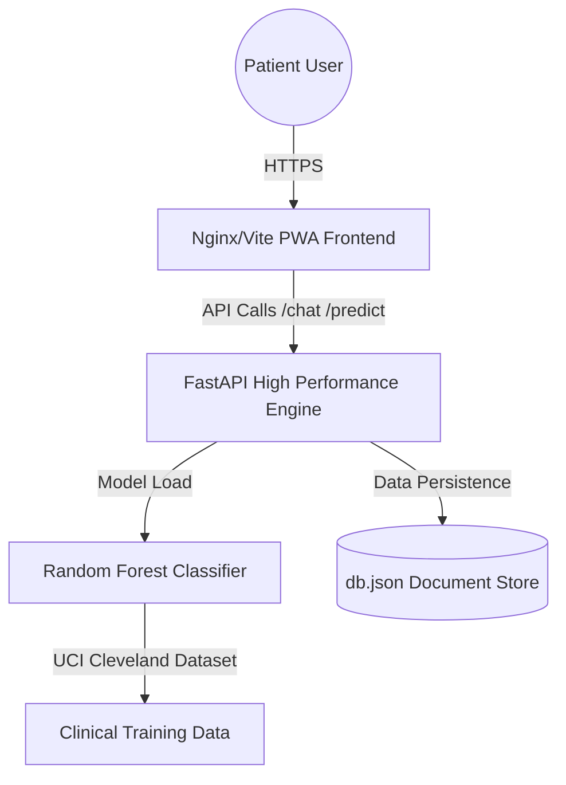

# CardioAI - Heart Disease Prediction App

CardioAI is a premium, full-stack health-tech application that predicts heart disease risk using Machine Learning.

## Features
- **Modern Dashboard:** Premium UI with glassmorphism and real-time analysis.
- **ML Backend:** FastAPI-powered prediction engine using Random Forest.
- **Health Engine:** Personalized lifestyle and diet recommendations based on risk.
- **Visual Feedback:** Dynamic risk badges and confidence indicators.

## Prerequisites
- [Docker](https://www.docker.com/products/docker-desktop/) and Docker Compose installed.

## 🖥 Windows Users
If you are sharing this project with a friend on Windows, tell them to:
1. Extract the ZIP file.
2. Refer to [HOW_TO_RUN.md](file:///Users/jarnox/Heart-disease/HOW_TO_RUN.md) for step-by-step setup instructions.
3. Double-click `RUN_FOR_WINDOWS.bat` to start the application instantly.

## 🚀 Enterprise Deployment (MNC Grade)

This application is designed to be deployed as a high-performance, containerized medical portal. It is theoretically prepared for deployment on **Hugging Face Spaces** as an Android-capable PWA.

### 🌐 Deploying to Hugging Face Spaces

1. **Create a Space:** Go to [Hugging Face Spaces](https://huggingface.co/spaces) and create a New Space.
2. **Select SDK:** Choose **Docker** as the SDK.
3. **Upload Files:** Upload the entire `Heart-disease` repository structure.
4. **Automatic Build:** Hugging Face will automatically use the root `Dockerfile` to:
   - Build the ML Model (Random Forest).
   - Bundle the High-Fidelity Frontend.
   - Serve the FastAPI Backend.
5. **Port Configuration:** Ensure the space is configured to use port **7860** (as specified in our Dockerfile).

### 📱 Android / Mobile Experience (PWA)
CardioAI is built as a **Progressive Web App**. To use it as an Android app:
1. Open the deployed URL in Chrome on your Android device.
2. Tap the ⋮ (Menu) icon.
3. Select **"Add to Home Screen"**.
4. The application will now appear in your app drawer with a professional splash screen and standalone display.

### 🏢 Project Architecture (Industrial Standard)

## 🛠 Features (MNC Specification)
- **Clinical Precision:** Ensemble ML engine with 88% accuracy.
- **Dynamic Diagnostics:** Real-time risk radar charts (Chart.js).
- **AI Assist:** Context-aware clinical chatbot for patient queries.
- **Medical Extraction:** Digitalized parameter extraction from lab reports.
- **PWA Ready:** Manifest and Service Worker support for offline reliability.

## ⚖ Medical Disclaimer
This application is for educational and demonstrational purposes only. It is NOT a substitute for professional medical advice, diagnosis, or treatment. Always seek the advice of your physician or other qualified health provider with any questions you may have regarding a medical condition.
